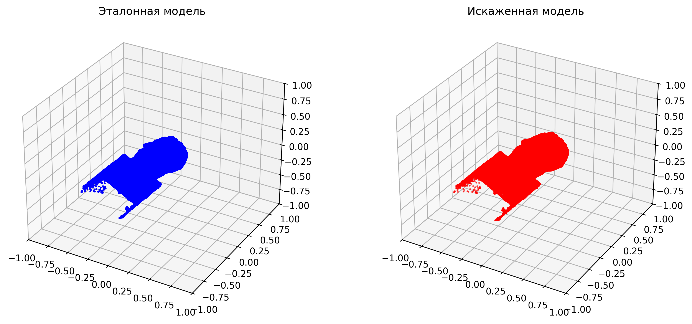
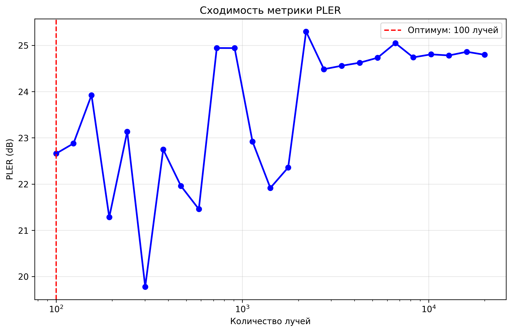
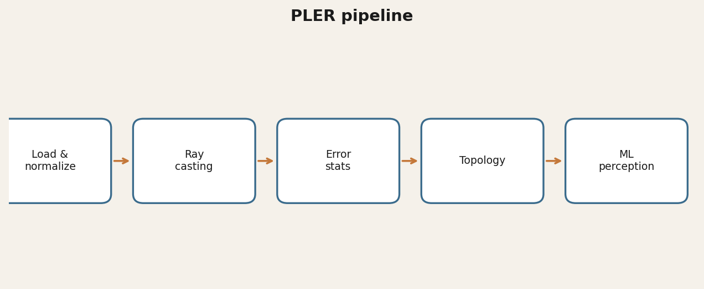
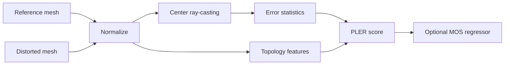

# PLER — Peak Length Error Ratio

**Full-reference metric for geometric quality of 3D meshes**, with topology features and an optional ML perception predictor.

[](https://www.python.org/)
[](LICENSE)
[](https://glebvoronkov03.github.io/gleb-web-portfolio/projects/pler.html)

> Author: **Gleb Voronkov** · Non-commercial research license · Commercial use requires written permission.

## Demo



<p align="center"></p>

## Why it matters
Standard mesh distances (Chamfer / Hausdorff) do not always match how humans perceive 3D distortion. PLER combines **center-based ray-casting**, error statistics, and **topological descriptors**, and can train a regressor against subjective scores (MOS).

## Architecture





## Quickstart
```powershell
python -m venv .venv
# Windows: .\.venv\Scripts\Activate.ps1
# Linux/macOS: source .venv/bin/activate
pip install -r requirements.txt
python pler_metric.py models/simple_reference.obj models/simple_distorted.obj
python pler_advanced.py models/simple_reference.obj models/simple_distorted.obj
```

Create tiny demo meshes if needed: `python create_test_models.py`

## Results
- Cache acceleration up to **~1.8–3.7×** on repeat runs (local tests)
- Open3D / Trimesh pipeline with research batch modes for degraded mesh series
- Cross-validated against classic geometric metrics in [3d-quality-bench](https://github.com/GlebVoronkov03/3d-quality-bench)

## License & citation
**Non-Commercial Research License** (`LICENSE`). Personal / academic use with attribution OK.  
Commercial products/services → `mybook3@mail.ru` / Telegram `@Gleb_Voronkov`.  
See `CITATION.cff` for bibliographic metadata.

## Links
- Portfolio: [https://glebvoronkov03.github.io/gleb-web-portfolio/projects/pler.html](https://glebvoronkov03.github.io/gleb-web-portfolio/projects/pler.html)
- Related: [3d-quality-bench](https://github.com/GlebVoronkov03/3d-quality-bench)
- Contact: Moscow · `mybook3@mail.ru` · [@Gleb_Voronkov](https://t.me/Gleb_Voronkov)
